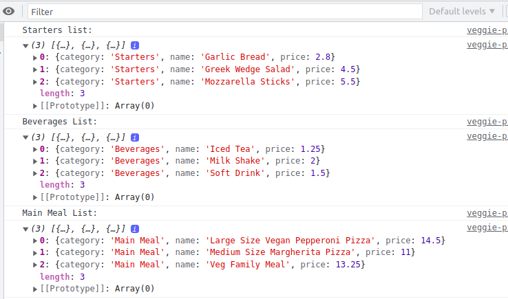
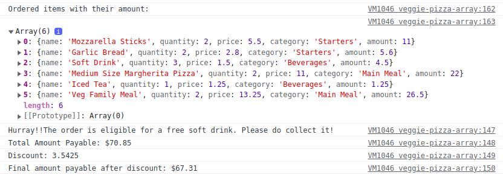

## Calculate Final Bill Amount for the Veggie Pizza Outlet Using Array Methods ​

### Problem Statement

Veggie Pizza is a pizza delivery outlet that became popular for its custom-made vegetarian pizzas. A customer can order pizzas and other items by calling the outlet. The outlet delivers the order to the address specified by each customer.​
​
Write a JavaScript program to calculate the final bill amount the customer should pay for the order placed.

**The Veggie Pizza Menu is given in the below table**
​
| Category​ | Name​ | Price​ |
|-|-|-|
| Beverages​ | Soft Drink | $1.5​
| Starters​ | Garlic Bread ​| $2.8​
| Starters​ | Mozzarella Sticks​ | $5.5​
| Main Meal​ | Medium Size Margherita Pizza​ | $11​
| Beverages​ | Iced Tea​ | $1.25​
| Starters​ | Greek Wedge Salad​ | $4.5​
| Beverages​ | Milk Shake​ | $2.00
| Main Meal​ | Veg Family Meal​ | $13.25​
| Main Meal​ | Large Size Vegan Pepperoni Pizza​ | $14.5​

### Tasks

- The challenge can be performed by the following tasks.​
   - Task 1: Filter Menu Items Based on The Category
   - Task 2: Calculate the Discounted Final Bill Amount​

#### Task 1: Filter Menu Items Based on The Category
Whenever a customer wants to place an order and has a query relating to the items in a particular category, then the call executive should be able to see all the item details of the required category.​

Create JS function which takes menu and category name as its parameters to return the items in alphabetical order.​
   - Only beverages​
   - Only starters​
   - Only main meals​
- Use Array's filter() and sort() methods.​

**Note: Use the menu object provided in the boilerplate to perform operations.​**
​
#### Task 2: Calculate the Discounted Final Bill Amount​

The delivery store gives 1 soft drink free when the customer order contains 2 or more main meals. Also, a  5% discount is offered if the total bill amount >= $50. ​

After the customer places an order, the call executive should be able to calculate the total amount of each item ordered, the total bill amount, and the final discounted amount using the Array methods.

Following are the steps to perform the task 2.
- Step 1: Calculate and return the total amount of each item ordered.​

  - The below table is provided in the boilerplate code as an object called order. 

      | Name​ | Price(USD)​ | Quantity​ |
      |-|-|-|
      | Mozzarella Sticks​ | 5.5​ | 2​ |
      | Garlic Bread​ | 2.8​ | 2​ |
      | Soft Drink | 1.5​ | 3​ |
      | Medium size Margherita Pizza​ | 11​ | 2​ |
      | Iced Tea​ | 1.25​ | 1​ |
      | Veg Family meal​ | 13.25​ | 2​
   - Define a function to calculate the amount for each item ordered. It should return an array of objects where each object has name, quantity, price, category, and amount as its properties. ​
   - Use Array's map() method to transform each order item. 
   - The below table represents the transformed order object that should be returned.
  
      | Name​ | Quantity|Price | Category | Amount|
      |---|---|---|---|---|
      | Mozzarella Sticks​ |2| 5.5​ | Starters|11
      | Garlic Bread​ | 2|2.8​ |Starters|5.6
      | Soft Drink | 3|1.5​ | Beverages|4.5
      | Medium size Margherita Pizza​ | 2|11​ | Main Meal|22​ |
      | Iced Tea​ | 1|1.25​ | Beverages|2.5
      | Veg Family meal​ | 2|13.25​ | Main Meal|26.50|

- Step 2: Count the number of main meals ordered to provide free soft drink for the order and return the same​.
   - One soft drink is given free when the order contains 2 or more main meals.​
   - Define a function to count the number of main meals ordered and return the result.​
      - Use Array's filter() and reduce() methods with the transformed order object.​
      - Function chaining should be used when multiple methods are called on the same array consecutively. ​

- Step 3: Calculate and return the total bill amount.​
   - Define a function to find the total amount of the order.​
   - Use Array's reduce() method with the transformed order object to calculate the total amount and return the result.

- Step 4: Calculate and return the final bill amount after discount.​
   - A discount of 5% is applied if the bill amount is >= $50.​
   - Define a function to calculate the final amount based on the customer order.​
      - Calculate the discount (if applicable)​
      - Subtract the discount from the total amount to get the final amount.
      - Return the final amount after rounding it to 2 decimals.

- Step 5: Return a message if the order is eligible for free soft drink.​
   - Define a function that returns a message if the order is eligible for free soft drink otherwise should return null.​
      -  The message should be `Hurray!!The order is eligible for a free soft drink. Please do collect it!`

Just for reference, the sample expected output when executed in JavaScript Debugging panel is given below:

​

   Run the command `npm install` to install the dependencies.
   Run the command `npm run test` to test the solution locally.
